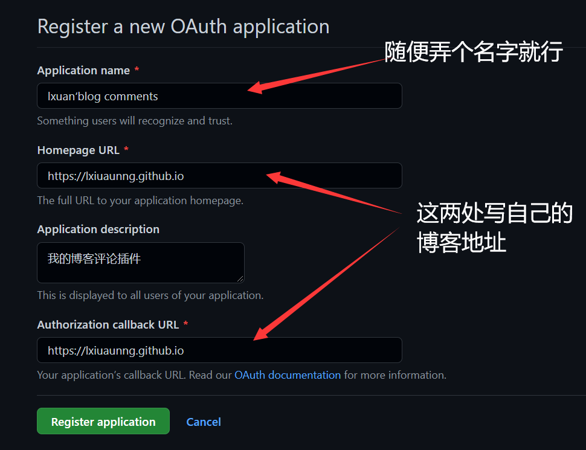
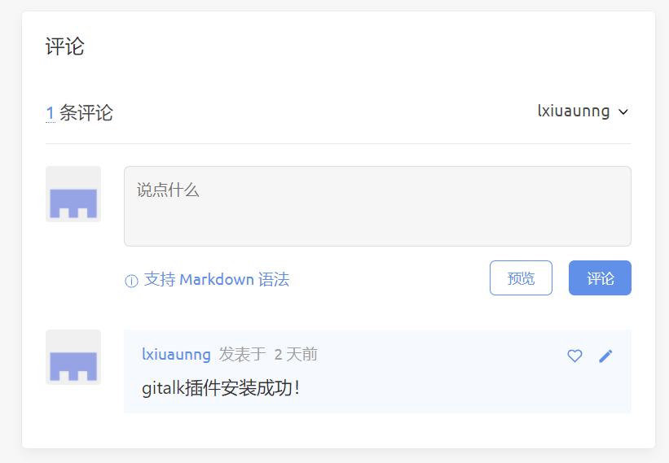

总体分为三步，相比较其他主题需要一些繁琐的配置，icarus就简单很多

<!--more-->

1. 登陆GitHub并[点此注册](https://github.com/settings/applications/new)一个新的OAuth应用

   
   随后记录下Client ID与Client Secre，等下要用

   > Client ID
   > xxxxxxxxxxxxxxxxxxxx
   > Client Secret
   > xxxxxxxxxxxxxxxxxxxxxxxxxxxxxxxxxxxxxxxx

 

2. [进入此网页](https://github.com/gitalk/gitalk)往下拉，有这样一句命令，在博客根目录执行：

   > npm i --save gitalk #安装gitalk插件

 

3. 打开根目录下的_config.icarus.yml文件，添加配置
   
   >   comment：
   >   type: gitalk
   >   owner: lxiuaunng   #你的GitHub用户名
   >   repo: lxiuaunng.github.io   #你的博客地址
   >   client_id: 0b26fddaf37d93589745
   >   client_secret: 1c15538585140bf3ef0b9f5dd2c01569055cf8ba
   >   admin: lxiuaunng   #同样是你的GitHub用户名

 
4. 在博客根目录下打开git bush，先hexo clean，再hexo s->g->d
基本上就是这样了

