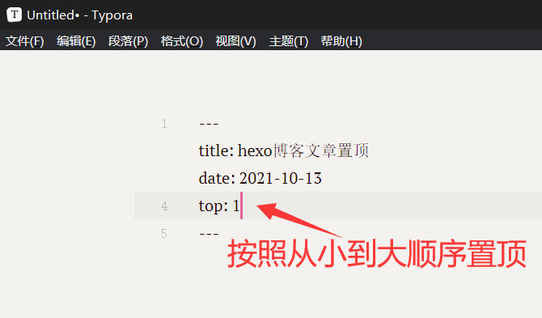

无需下载插件，添加一段代码即可
<!--more-->
修改`Hexo/yourblog`文件夹下的`node_modules/hexo-generator-index/lib/generator.js`
需要添加的代码：
~~~
posts.data = posts.data.sort(function(a, b) {
      if(a.top && b.top) {
          if(a.top == b.top) return b.date - a.date;
          else return b.top - a.top;
      }
      else if(a.top && !b.top) {
          return -1;
      }
      else if(!a.top && b.top) {
          return 1;
      }
      else return b.date - a.date;
  });
~~~
 

以下是最终的generator.js内容：
~~~
'use strict';

const pagination = require('hexo-pagination');
const { sort } = require('timsort');

module.exports = function(locals) {
    const config = this.config;
    const posts = locals.posts.sort(config.index_generator.order_by);

    posts.data = posts.data.sort(function(a, b) {
        if (a.top && b.top) {
            if (a.top == b.top) return b.date - a.date;
            else return b.top - a.top;
        } else if (a.top && !b.top) {
            return -1;
        } else if (!a.top && b.top) {
            return 1;
        } else return b.date - a.date;
    });

    sort(posts.data, (a, b) => (b.sticky || 0) - (a.sticky || 0));

    const paginationDir = config.pagination_dir || 'page';
    const path = config.index_generator.path || '';

    return pagination(path, posts, {
        perPage: config.index_generator.per_page,
        layout: ['index', 'archive'],
        format: paginationDir + '/%d/',
        data: {
            __index: true
        }
    });
};
~~~
 
使用方法：在需要置顶的文章添加top属性即可，排序从小到大  

文章转自[博客园：試毅-思伟](https://www.cnblogs.com/zhousiwei/p/10625646.html)