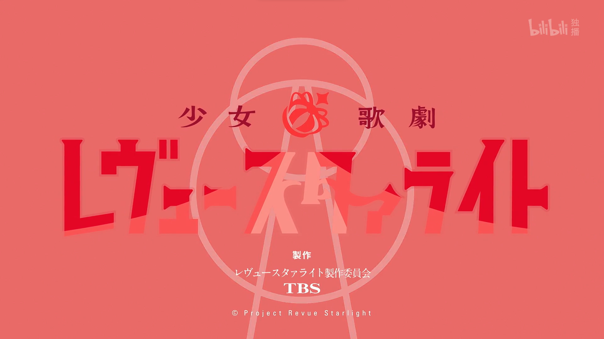
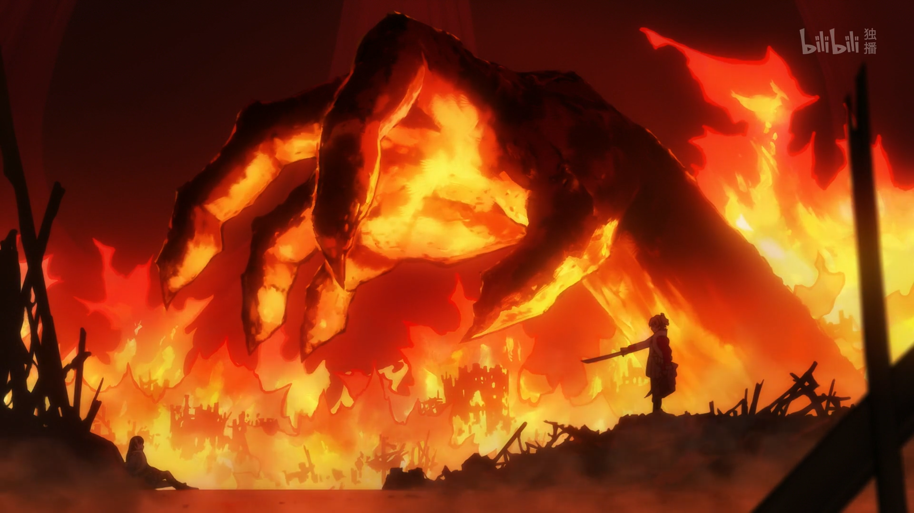
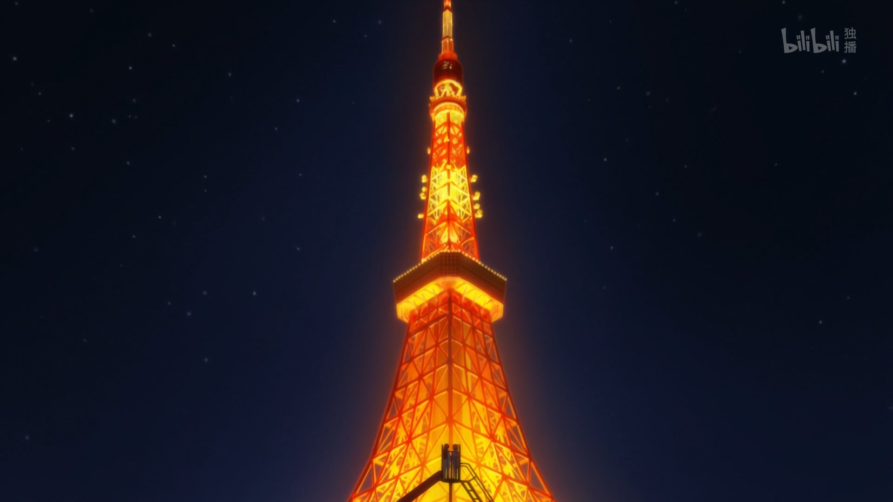
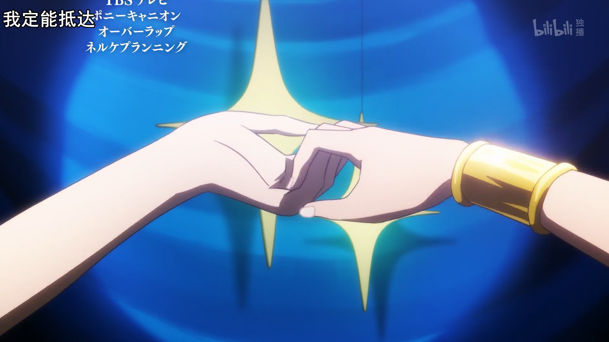
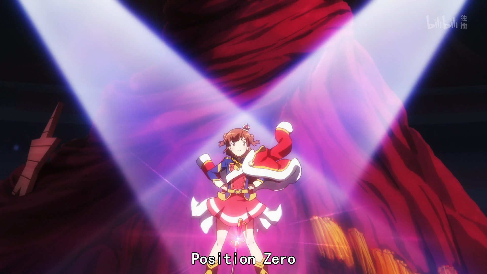
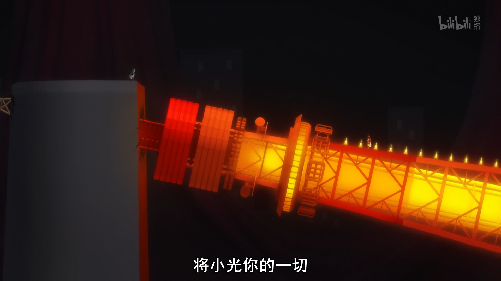
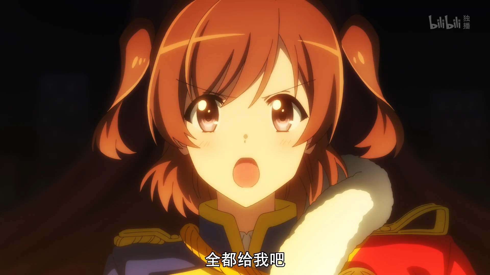
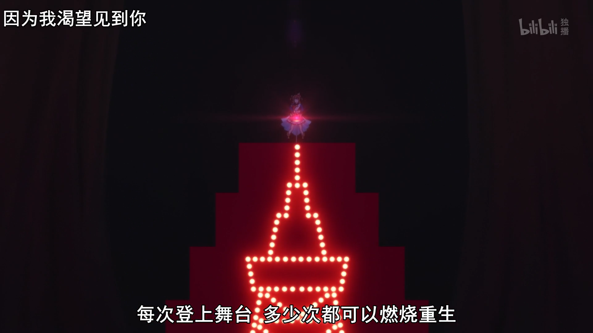
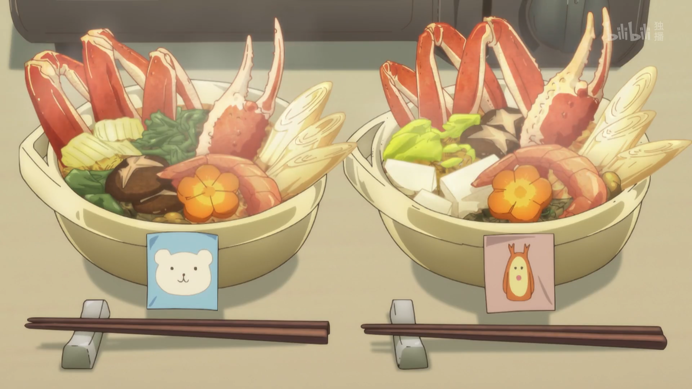

《少女歌剧》--我最喜欢的意识流动漫，至少在我看来是有点意识流的，她们的歌剧中讲述的不仅仅是她们自己的故事，也是我们的人生。世界在改变，我们不会有一成不变的舞台，鼓起勇气，拒绝这个悲剧的结局吧！
<!--more-->

少女歌剧，我很难去评价的一部作品，它的精彩程度让我难忘，时而欢快，时而悲恸，时而感动。

守护爱人的小光、誓要与她一起站在最高处的华恋、将美好永远留在这一刻的奈奈等等，她们身上的感情纯粹而又复杂，像交织在一起的蛛网，少女们慢慢地将其一一解开。

“舞台和舞台少女都是不断改变的”

正如长颈鹿说的那样，观众想看的是无法预测的舞台，不是无限重复的悲剧，无论是奈奈还是光，都是甘愿让自己承受一切，可你就是爱你的人的舞台，你们是彼此的星，这场悲剧该结束了，我否定这悲剧的结局。我的星星是你，你的星星是我，不是天上的那颗。

这部作品太过精彩，每一位角色的战斗都是独属于她自己的歌剧，从相知，到相爱，是那么的美丽。“闪耀”可以是任何你最珍贵的东西，或者你爱的人，在人生的这个舞台上，倾尽所有，打破一切，不去在意过去和未来，谱写你的命运。

再优秀的人也有忘记自我的时候。	--威廉·莎士比亚

人不同，时间流逝的速度也会不同。	--威廉·莎士比亚

不前进则后退，正如过去影响当下，未来也影响当下。	--尼采

做你想做的自己，永远都不嫌晚。	--乔治·艾略特

人生最大的失败是害怕失败。	--阿尔伯特·哈伯德

