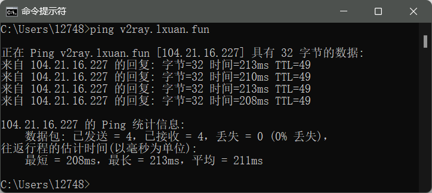

# 搭建v2ray

## 准备工作

1. 购买一个域名（备案或不备案都可以）
2. ~~注册[Cloudflare](https://www.cloudflare.com/zh-cn/)~~
3. 购买一个（国外、香港或者台湾都行）vps
4. 下载远程连接工具（xshell等）
5. 下载[v2ray](https://github.com/2dust/v2rayN)软件

## 域名解析

1. 打开你购买的域名的服务商网址

2. 找到域名解析

3. 添加二级域名并解析地址为你购买的vps的ip

4. 等待十分钟后用本电脑自带的命令窗口ping一下你解析的网址，如下则解析成功



## 一键搭建

1. vps系统选择Centos 7、Centos 8都可以

2. 远程连接

3. 输入以下命令

   ```cmd
   bash <(curl -sL https://cdn.jsdelivr.net/gh/Misaka-blog/Xray-script@master/xray.sh)
   ```
   
4. 选择4，并回车
   
5. 输入你解析的网址

6. 之后一路回车就好，开始安装后静静等待5-10分钟

7. 安装成功后会输出一串 **vmess://** 开头长达三四行的链接

8. 将连接复制到v2ray软件就可以直接使用了

