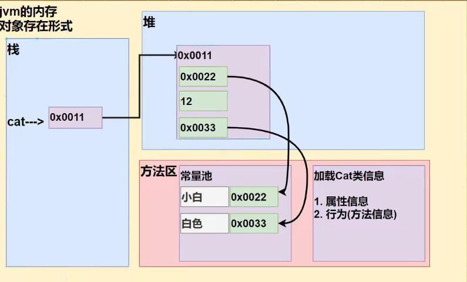

[TOC]


# 类与对象




## 作用域

全局变量（属性）可以不赋值，直接使用，因为有默认值，局部变量必须赋值后才能使用，因为没有默认值。

1. 属性和局部变量可以重名，访问时遵循就近原则。
2. 同一个作用域中，两个局部变量不能重名。
3. 全局变量可以加修饰符，局部变量不行。

## 构造器

  构造方法又叫构造器（constructor），是类的一种特殊方法，它的主要作用是完成对<u>*新对象的初始化*</u>。

1. 构造器修饰符可以默认，也可以是public protected private

2. <u>构造器没有返回值</u>

3. <u>方法名和类名必须一样</u>

4. 参数列表和成员方法一样的规则

5. 构造器的调用，由系统完成

6. <u>构造器可以重载</u>

   new 一个新对象的时候，会自动执行构造器，因此new时可以直接赋值，如：

   Person p1 = new Person ("梁渲"， 20);

## this关键字

this(参数列表)只能在构造器中使用，也就是在一个构造器中访问另一个构造器，必须放在第一条语句，即同一给构造器中只能出现一次

## 对象可以为空，也就是说返回值可以为null

## 数组可以为空

## 方法中的变量称为局部变量，之外的变量称为全局变量，this.是全局变量

## 一个Java源文件中可以有多个主类，但是只能有一个公共类或者没有公共类

java源文件在运行后会被编译成一个个class文件，但public类只能有一个，而主类main()方法可以有多个，main()方法是程序执行的入口

# 包

作用：

1. 区分相同名字的类
2. 当类很多时，可以很好的管理类[看Java API 文档]
3. 控制访问范围

---


# 继承

1. 如果子类有这个属性，则输出，如果子类没有这个属性，则依次往上找父类的属性。

2. 私有属性不能直接在子类中访问，需要用父类提供的公共方法去访问，如下。

   ```java
   class A {
     private name = "张三";
     
     public String getName () {
       return name;
     }
   }
   class B extends A {
     
   }
   main{
     B b1 = new B;
     System.out.print(b1.name); // 报错
     System.out.print(b1.getName); // 返回张三
   }
   ```

3. 子类的任何方法的第一行都存在一个 super() 方法，该方法用于执行父类的无参构造器；但 this(); 和 super() 不能共存，若是子类的构造器中存在 this(); 方法，则super(); 也就不会存在了。

---

# 多态

1. 一个对象的编译类型和运行类型可以不一致
2. 编译类型在定义对象时，就确定了，不能改变
3. 运行类型是可以变化的
4. 编译类型是看定义时 = 的左边，运行类型看 = 右边

## 4.1 Java的动态绑定机制

1. 当调用对象方法的时候，该方法会和该对象的**内存地址/运行类型**绑定
2. 当调用对象的属性时，没有动态绑定机制，哪里声明就在哪里使用

---

# 5. Object类详解

## 5.1 equals方法

==是一个比较运算符

> 1. 既可以判断基本类型，又可以判断引用类型
> 2. 如果判断基本类型，判断的是值是否相等。
> 3. 如果判断引用类型，判断的是地址是否相同，即判断是否是同一个对象。

equal：是Object类中的方法，只能判断引用类型，默认判断的是地址是否先等，子类中往往重写该方法，用于判断内容是否相等

| 名称  | 概念                             | 用于基本数据类型     | 用于引用类型                                                 |
| ----- | -------------------------------- | :------------------- | ------------------------------------------------------------ |
| ==    | 比较运算符                       | 可以，判断值是否相等 | 可以，判断两个对象是否相等                                   |
| equal | object类的方法，Java类都可以使用 | 不可以               | 可以，默认是判断两个对象是否相等，但是子类往往重写该方法，比较对象的属性是否相等，比如（String,Integer) |

