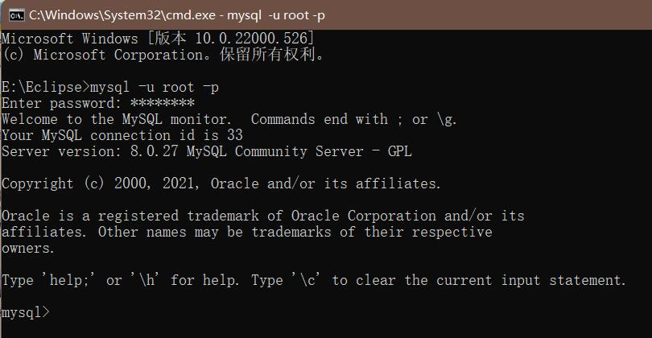

[toc]

# MySQL

## MySQL的服务与启动

1. net start mysql
2. net stop mysql

## MySQL服务的登陆和退出

1. 通过MySQL自带的客户端，仅限root用户

2. 通过windows自带的客户端，

   mysql [-h 主机名 -P 端口号] -u 用户名  -p 密码

## windows 下配置 mysql 可远程连接

1. 在防火墙入站规则里加入 3306 端口，3306 为你安装mysql 时的端口。

2. 在mysql 命令行中输入：

   > #应用mysql数据库
   > use mysql;
   > \#将root用户可访问改成所有
   > update user set host = '%' where user = 'root';
   > \#刷新权限,使配置起作用
   > flush privileges;
   > \#查看是否成功
   > select host, user from user;

