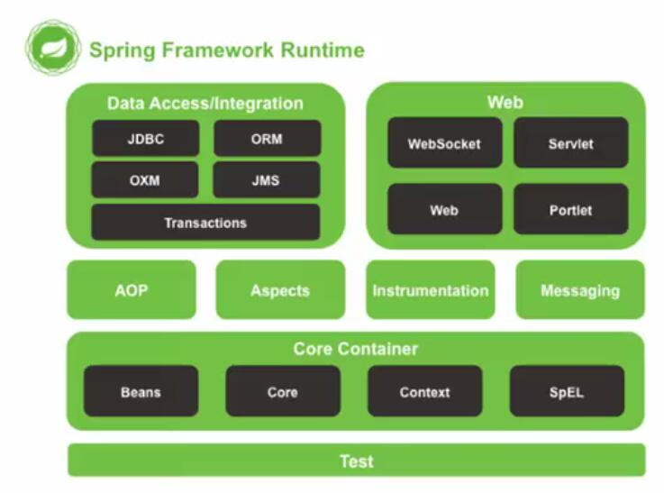

## 一、简介

### 1. Spring 是什么

Spring 是分层的Java SE/EE应用 full-stack 轻量级开源框架，以 **loC**（Inverse Of Control：反转控制）和 **AOP**（Aspect Oriented Programming：面向切面编程）为内核。

提供了展现层 **SpringMVC** 和持久层 **Spring JDBCTemplate** 以及**业务层事务管理**等众多的企业级应用技术还能整合开源世界众多著名的第三方框架和类库，逐渐成为使用最多的 Java EE 企业应用开源框架。

### 2. Spring 发展历程

1997年，IBM提出了EJB的思想
1998年，SUN制定开发标准规范 EJB1.0
1999年，EJB1.1发布
2001年，EJB2.0发布
2003年，EJB2.1发布
2006年，EJB3.0发布

**Rod Johnson（Spring之父）**
Expert One-to-One J2EE Design and Development(2002)
阐述了J2EE使用EJB开发设计的优点及解决方案
Expert One-to-One J2EE Development without EJB(2004)
阐述了 J2EE 开发不使用EJB的解决方式（Spring雏形）

### 3. Spring 的优势

1. 方便解耦，简化开发

通过 Spring 提供的 loC容器，可以将对象间的依赖关系交由Spring进行控制，避免硬编码所造成的过度耦合。用户也不必再为单例模式类、属性文件解析等这些很底层的需求编写代码，可以更专注于上层的应用。

2. AOP 编程的支持

通过 Spring的AOP 功能，方便进行面。编程，许多不容易用传统 OOP实现的功能可以通过AOP轻松实现。

3. 声明式事务的支持

可以将我们从单调烦闷的事务管理代码中解脱出来，通过声明式方式灵活的进行事务管理，提高开发效率和质量。

4. 方便程序的测试

可以用非容器依赖的编程方式进行几乎所有的测试工作，测试不再是昂贵的操作，而是随手可做的事情。

5. 方便集成各种优秀框架

Spring对各种优框架（Struts、Hibemate、Hessian、Quartz等）的支持。

6. 降低JavaEE API的使用难度

Spring对JavaEE API（如JDBC、JavaMail、远程调用等）进行了薄薄的封装层，使这些API的使用难度大为降低。

7. Java 源码是经典学习范例

Spring的源代码设计精妙、结构清晰、匠心独用，处处体现着大师对Java 设计模式灵活运用以及对Java技术的高深造诣。它的源代码无意是Java技术的最佳实践的范例。

### 4. Spring 的体系结构

