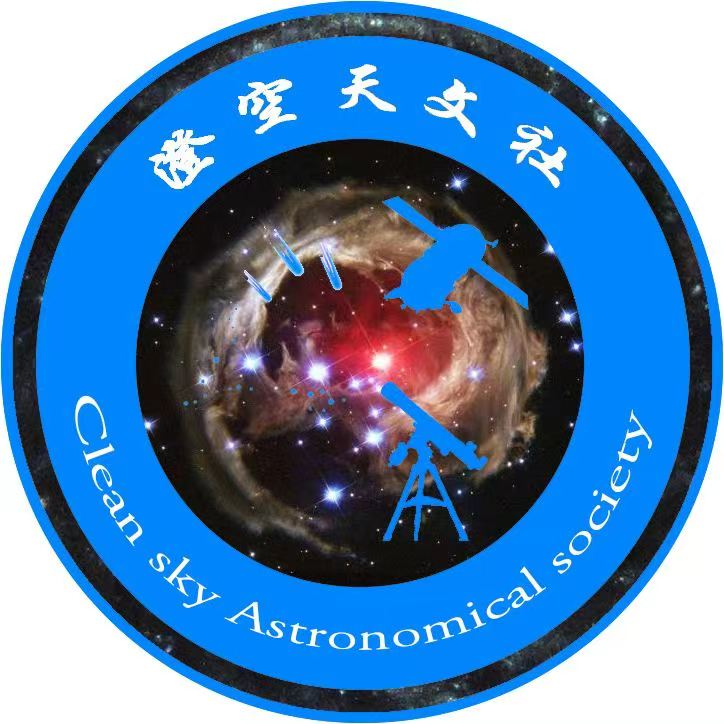

《澄空天文社关于社团的规章制度》

组织名称：澄空天文社

logo：

性质：澄空天文社是一个学术科普性社团，以校内喜爱天文的学生为基础而创建的社团组织。接受校团委直接领导和统一管理。

目的：为爱好天文社的广大同学搭建一个交流的平台

宗旨：丰富校园文体娱乐活动形式，积极开展活动，营造良好的校园文化氛围，充分发挥学生第二课堂作用，为校园文明建设服务。

宣言：星空不灭，梦想永存

地址：山西工商学院

组织结构：

附则：
1. 本章程解释权归山西工商学院澄空天文社所有
2. 社团章程未免有简略或不尽之处，日后由理事讨论通过尽可能把章程更完善
3. 本章程批准之日起实施

# 社长

## 副社长

### 学术部

### 科普部

### 设备管理与观测组织部

## 副社长

### 宣传部

### 组织部
