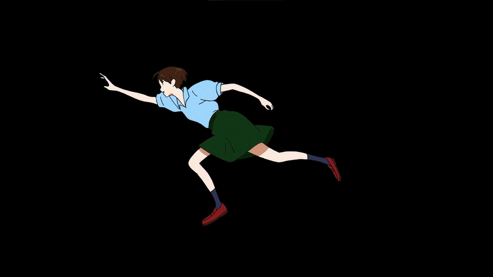
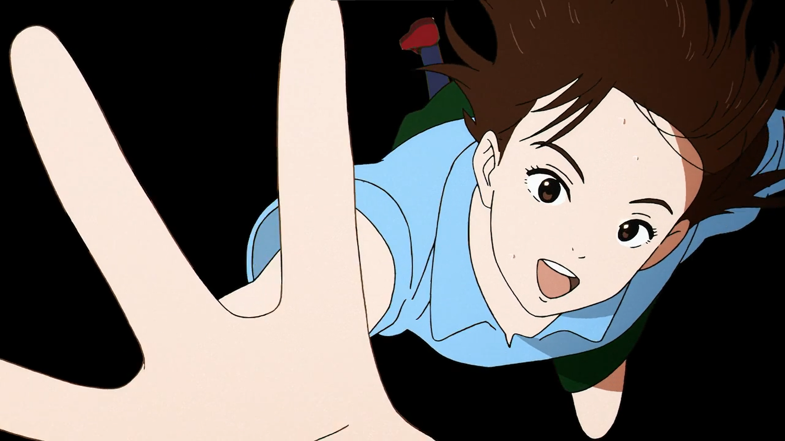
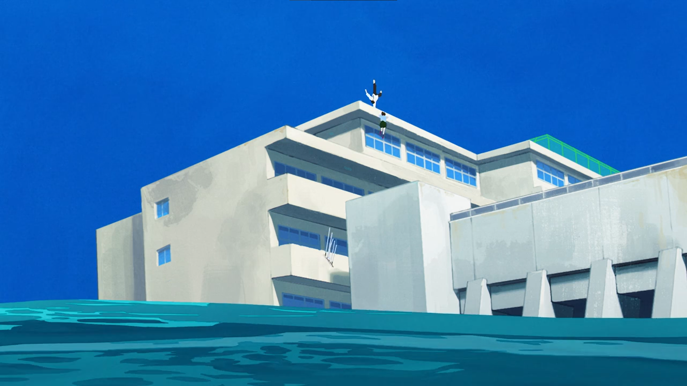
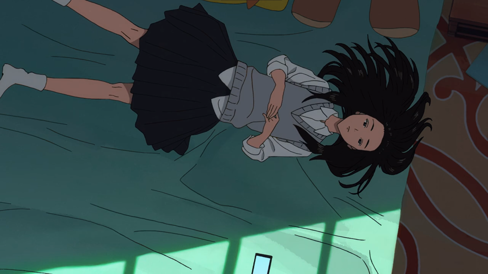
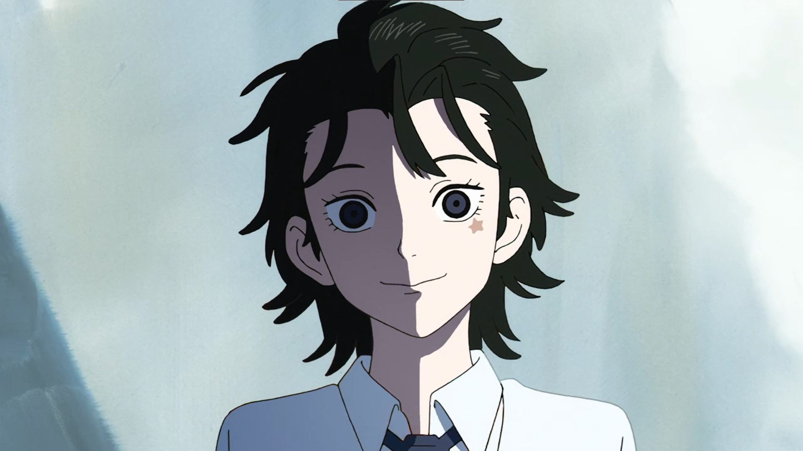
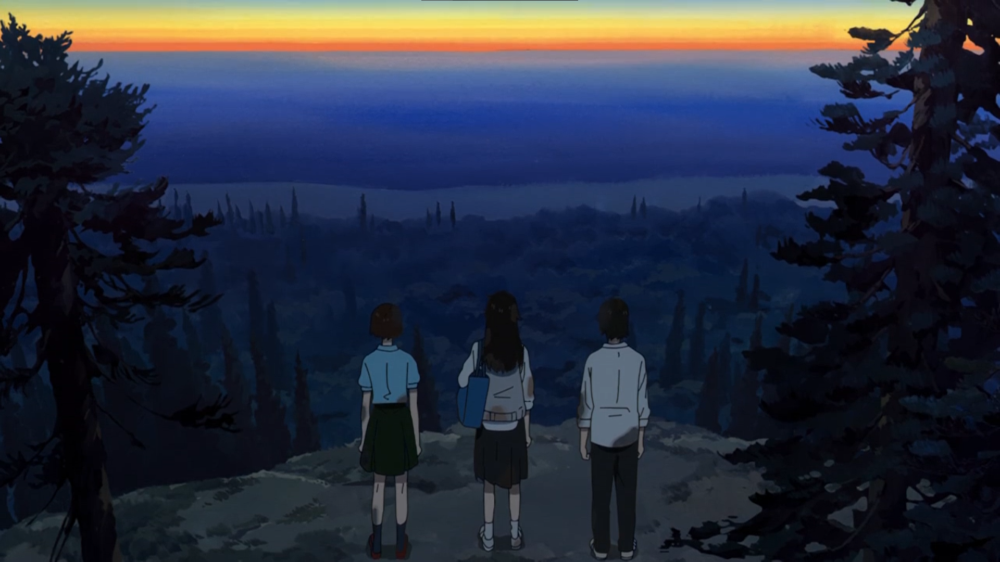
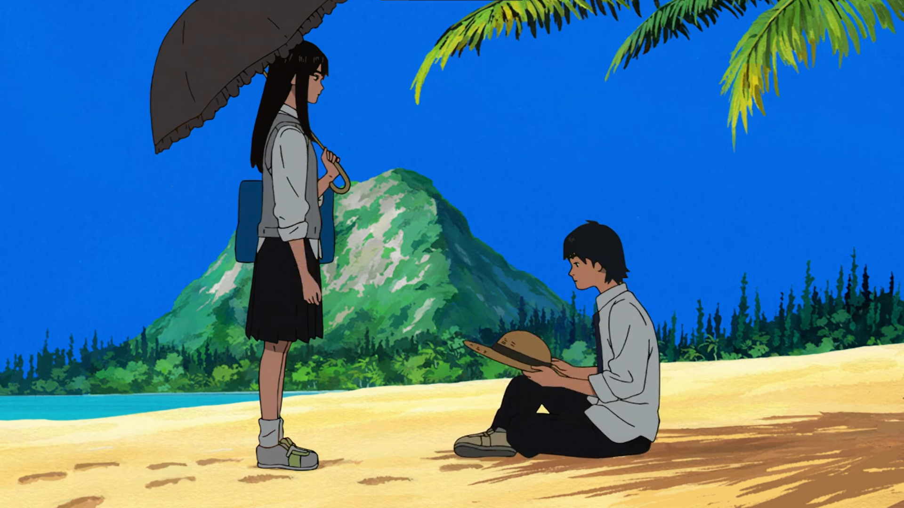
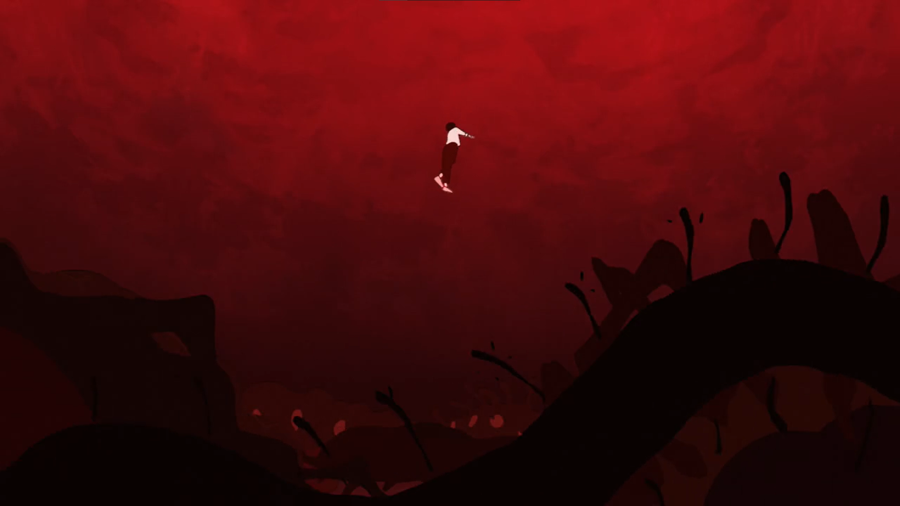
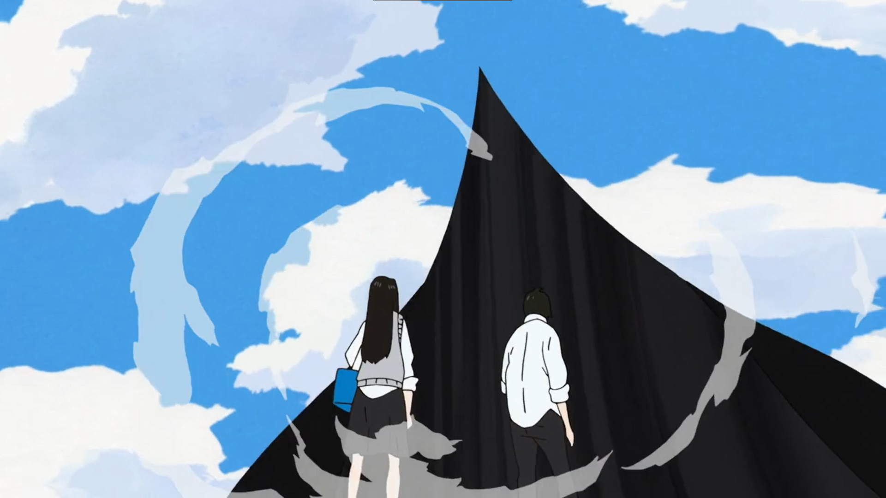
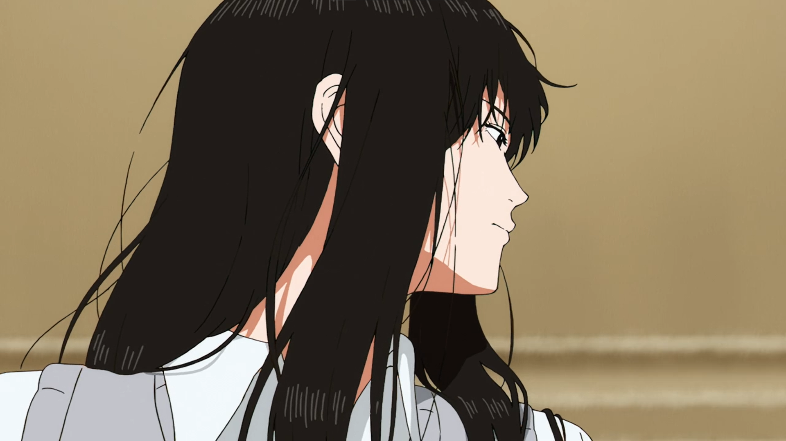

# 漂流少年

  前言：第一次接触这部片子，是在一位up的推荐视频里，我个人是不喜欢开弹幕看视频的，因为近年来弹幕对视频的负面影响愈来愈严重，但是有时弹幕也是一种跨越时空的交流，给人不少建议。“很好看”“墙裂推荐”“这部番超级好看的”等等词语或短句在这部片子播放的时候出现，独特的画风让我（感到好奇）眼前一亮，处处透漏着大胆和开创先锋的勇气，至于是否真的是开创了动漫的一条道路，还是又给二次元这片草原添一土坟，就得在看过之后才能下定义了，又或者我根本就没打算去真的看懂这部片子......

<!--more-->

##  第一集

一部动漫的开篇，一般是去讲述这个故事的背景和开始，然后展现主角或者配角的性格和人为，或孤僻而善良，或勇敢而弱小，或强大而懦弱。

这部片子的背景是，一座中学学校的三年级学生长良一行人进入了一个特殊的世界，那里只有学校这座建筑，学校之外都是无边无际的黑暗。越来越多的学生逐渐发现自己的（超）能力，一名叫做朝风的学生能力尤为突出，在练习能力中不断破坏玻璃（学校建筑被破坏后也会恢复原）。一位学生明星（初看并不像什么好人）设法建立了学生会这一组织，希望学生在没有老师的监管下也可以有序的生活，但是与习惯自由的朝风冲突，最后演化为轻微暴力事件。此次事件还未结束，女主希尝试逃离这里，沿着天台的一边跳进黑暗中，于是黑暗消失，大海出现了，与之出现的还有一座小岛。

## 第二集

该集主要讲述了女二瑞穗的背景和其初期的成长。学生们在小岛中定居，瑞穗利用自己制造物品的能力（其实是“喵马逊”，无论她想要什么，她身边的三只猫都会复制一份带过来）为大家提供便利，但瑞穗性格我行我素，不屑于与周围人搞好关系，一直孤立着。同时男二拉吉塔尼也展现出自己的智商才能，致力于探究这个世界，为同学们一些疑惑。瑞穗制造出的东西在同学们手中自然，发出蓝色火焰，被同学冤枉，后又被明星一行人裹挟，造成全岛的燃烧，拉吉塔尼将误会解开后也表示蓝色火焰是因为东西都是通过非交易手段获得，使用就会自然，要想获得他人的东西就要用“漂流币”（拉吉塔尼创造的虚拟货币）交易。

瑞穗在引发全岛大火的同时，长良发现了瑞穗的一只走丢的猫，穿过大火将猫送到了瑞穗面前，至此瑞穗和长良之间诞生友谊。

## 第三集

在这个世界里，有各式各样的“门“，长良很擅长找门，门中有各式各样不同的世界，很多都不适合人类生存。岛中出现一些怪事，陆续有同学变成一动不动的黑色人影，瑞穗被委托调查这件事，顺带带上了长良，二人在一处山丘发现了门，消失的同学们都在其中，摧毁门（门其实是一片幕布）后救出同学们。

在此事件的过程中瑞穗因为讨厌长良懦弱而不善表达的性格和长良产生矛盾，事件结束后两人又握手言和。或许这映证着长良的第一次成长。

