# 紫罗兰永恒花园

“只要是客人的愿望，不论天涯海角我们都竭诚为您服务，自动笔记人偶服务薇尔莉特·伊芙加登”
<!--more-->

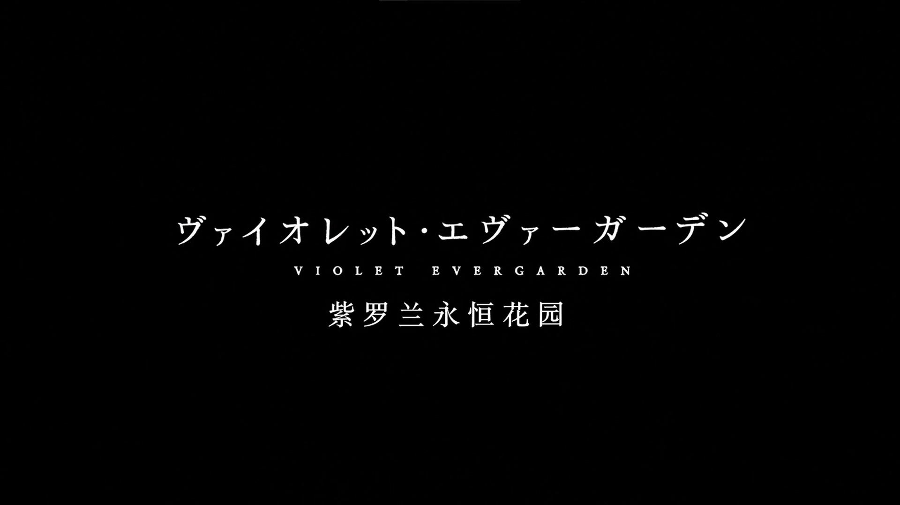

## 
OP

每每学会未知的词语

仿佛触及你的追忆

但是或许也会有单词

只身一人   终究无法理解

再见  是苦涩的

我爱你   则带着遥远的气息

无可比拟的这份情愫

让我胆战心惊   却又让我心动不已

为什么的眼里噙满泪水

该怎么回答我的心灵

话语总在嘴边

越是说不出口   越是揪人心肠

让我想要与你相见

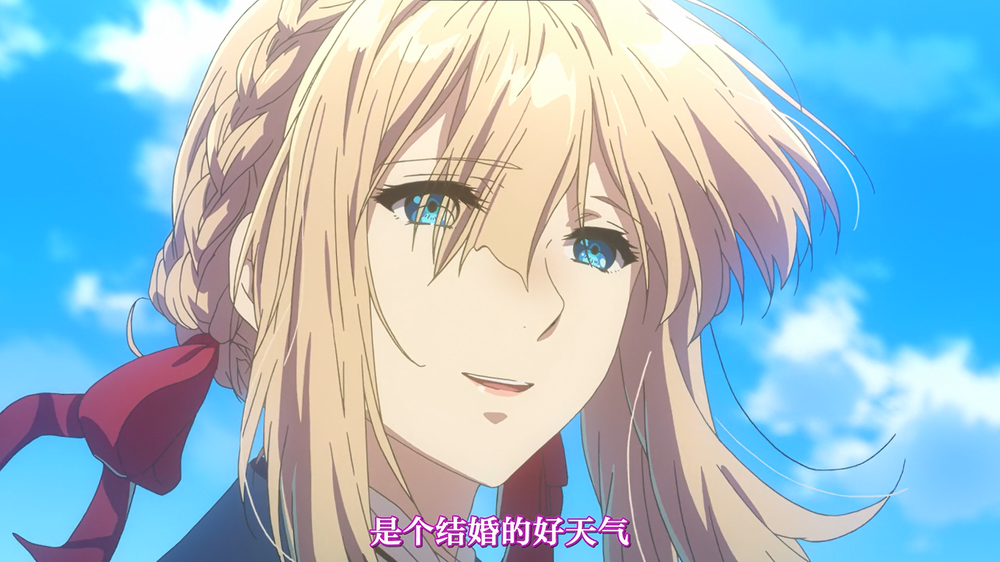

“对我来说，那个人的存在就是我的整个世界，要是他离我而去，那我也唯有一死”

 

“薇尔莉特，怎么样，你在看吗？”

“我在，这是我第一次这么近的看星星”

“不是星星，是彗星！”

“我们今生今世再也不能与它相见了”

 

“然此非悲恸之别离   逝者当于   久远之妖精之国   得新生   其魂不灭   亘古永存”

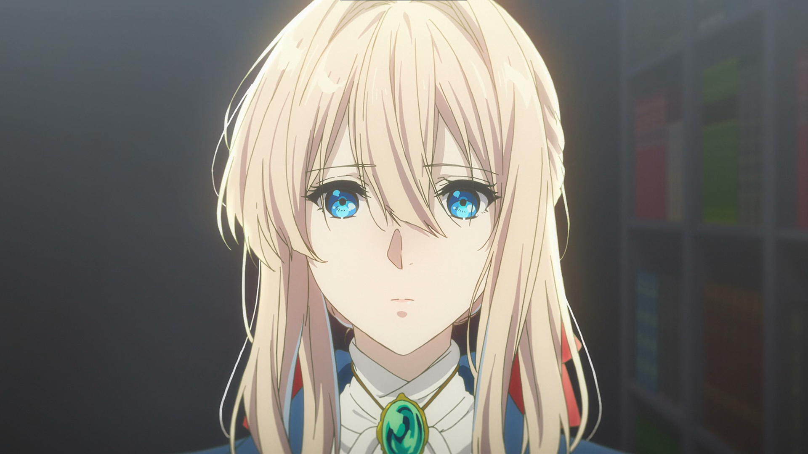

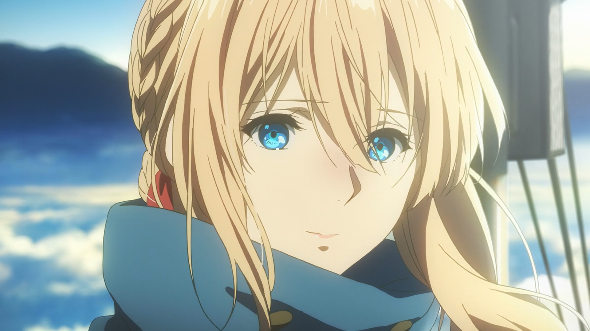

“只要是客人的愿望，不论天涯海角我们都竭诚为您服务，自动笔记人偶服务薇尔莉特·伊芙加登”
 
“这把伞就是你的翅膀，但要是飞得太高会被风儿卷走，所以在海上就踏着浪花，在溪上就踏着青石，在湖面就踏着落叶飞回去”
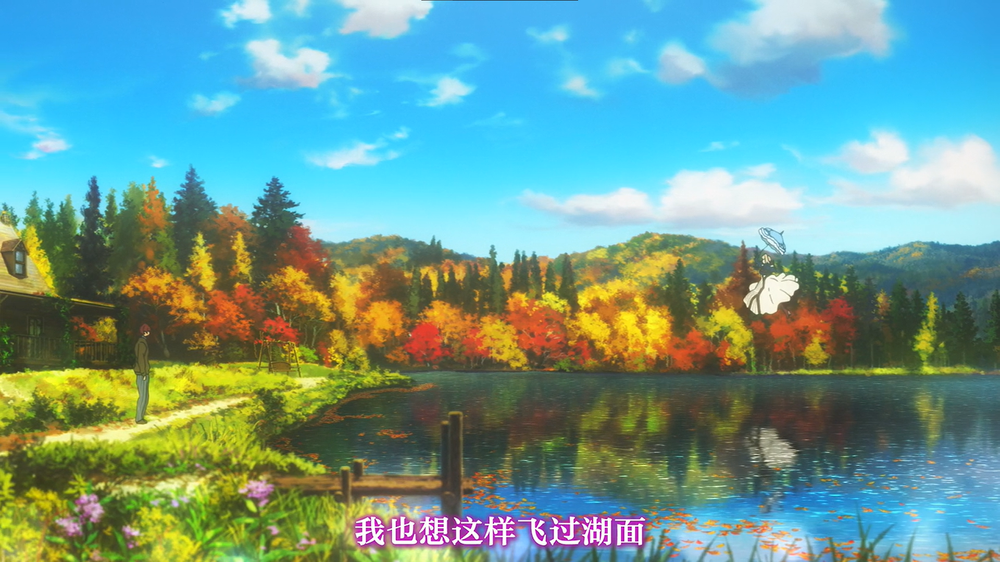

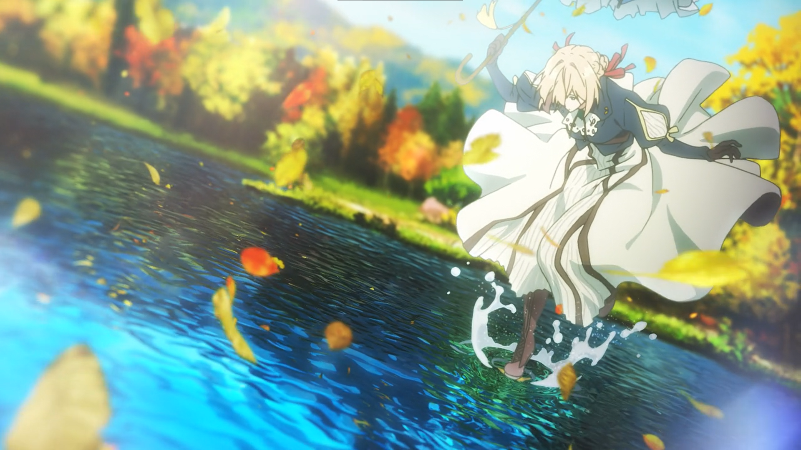

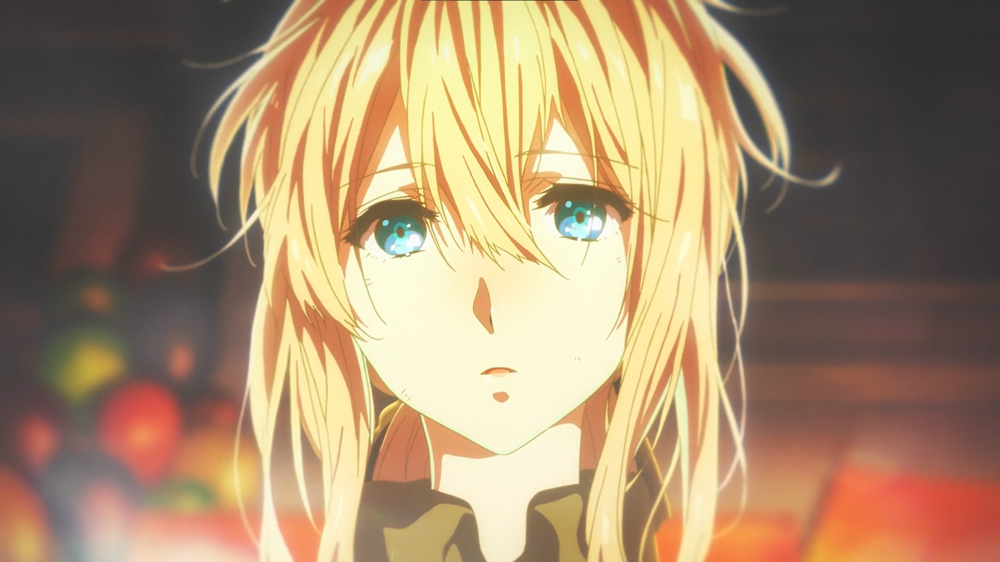

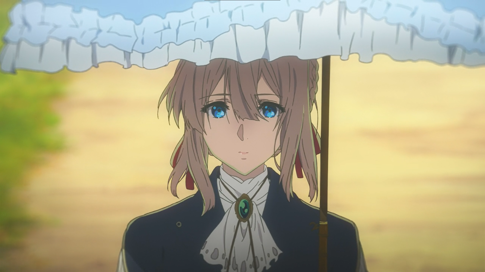

## 
剧场版-终

<pre>
  首先我得承认，我是不希望在荧幕上看到这位少校活蹦乱跳的，因此你们可以认为我对终章的剧情并不很喜欢。其实我对整部剧的剧情的评价都不算太高，讲的高情商一点，该剧是有点意识流的，很多剧情有点点强硬，着重描写了人物们的情感，加上优美的背景和动听的音乐将其渗入每一位观众的心中，以此来产生共鸣，以至于对剧情方面有所欠缺，但都还可以接受。倒不如说这些方面很大程度地拉高了这部剧的逼格，剧情就显得粗糙且突出。
  剧场版或者说终章的剧情相比较TV是有很大进步的，大概7->8.5分这样的进步，加上9.9999分的画风和9.9999分的音乐，9.5分的评价并不为过。无论是苦苦追寻爱意的薇尔莉特，还是怀着赎罪之心的少校，在他们相遇的那一刻，无言便是对双方最好的回答。
  我爱你，这三个字如山石般沉重，让人步履维艰；如羽毛般轻盈，让人踏遍山河；如云雨般漂泊，让人猝不及防；如草木般倔强，让人向死而生。
  祝愿世界上每一个生物都有能有配偶:-D
</pre>

自己截下来的一些图片：

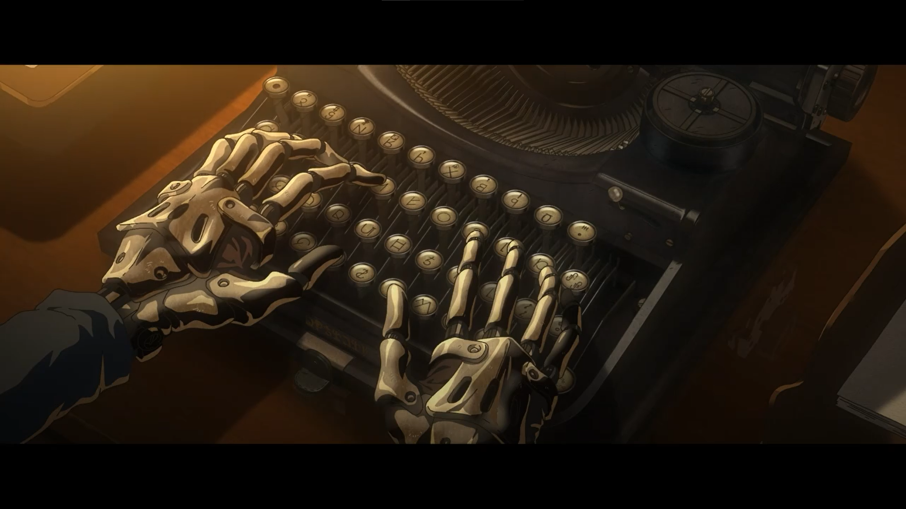

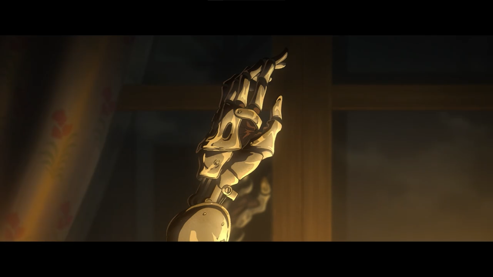

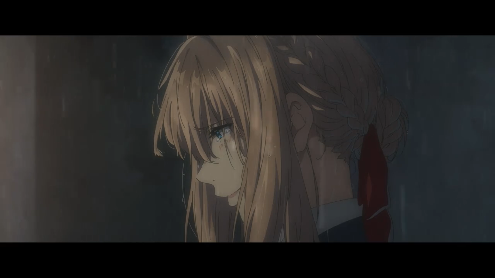

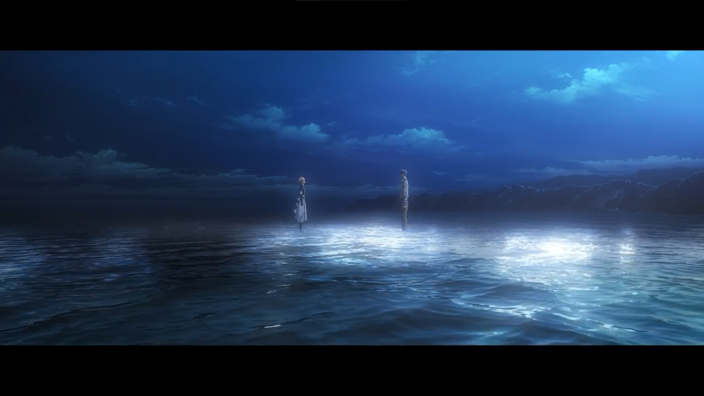

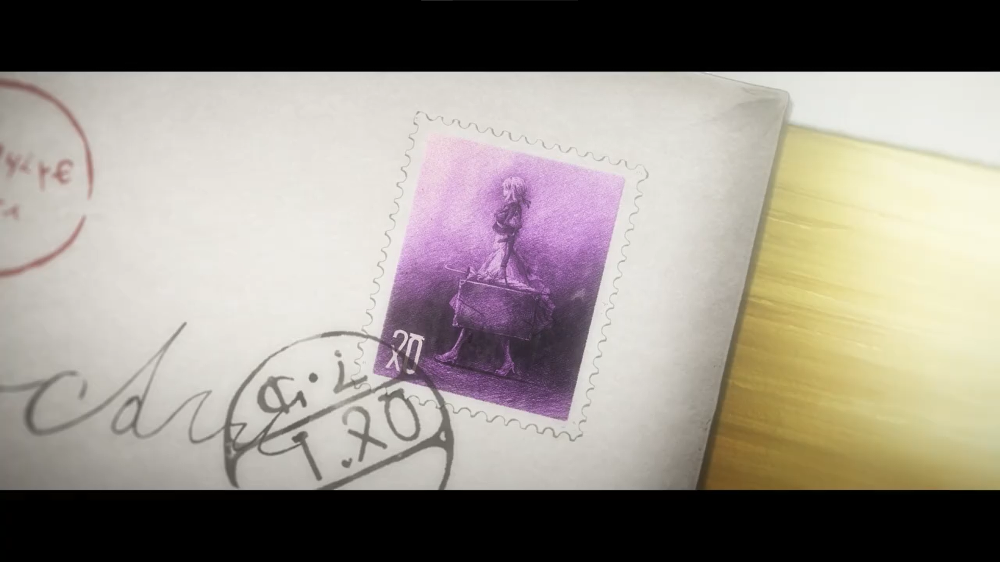

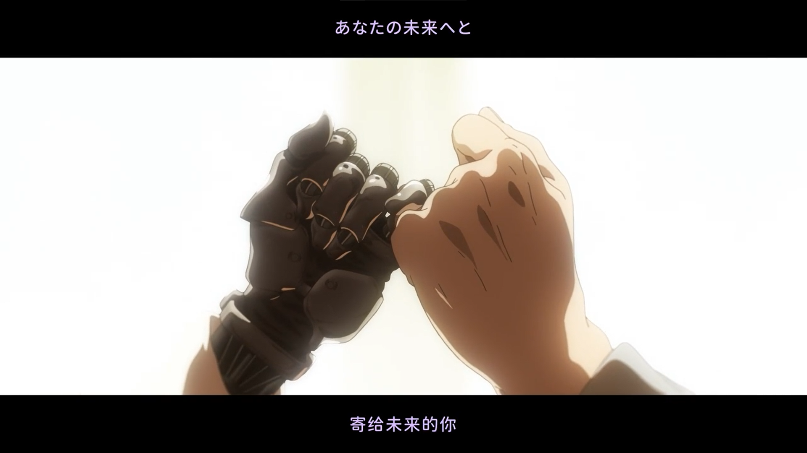

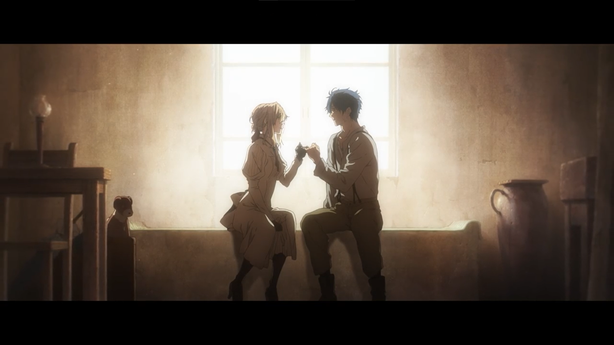

    

    <iframe frameborder="no" border="0" marginwidth="0" marginheight="0" width=330 height=86 src="//music.163.com/outchain/player?type=2&id=534065323&auto=1&height=66"></iframe>

